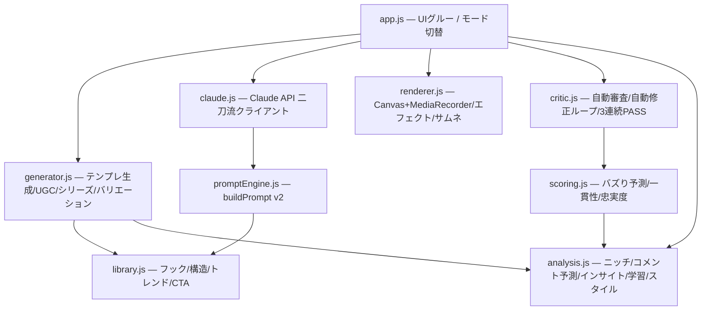

# 🎬 TikTok動画工場 — 大バズ特化版 v2

商品ページのデータから高品質なTikTok動画（9:16 / Canvas + MediaRecorder書き出し）を生成し、
ニッチ内で継続的に大バズを量産するためのツール。**PRD v1.0 の全15改善案を実装済み。**

## 使い方

`index.html` をブラウザで開くだけ（ビルド不要・サーバー不要・完全ローカル動作）。

1. **作成タブ**: 商品データを貼り付け → フック型・構造を選択 → 「生成」
2. スコア（合格ライン80点）とCritic審査を確認 → 「自動修正ループ」でPASSまで自動改善
3. プレビュー再生 → 「動画書き出し」でwebm/mp4をダウンロード
4. **分析タブ**: ニッチ分析・コメントインサイト抽出
5. **運用タブ**: 投稿結果を記録 → フック型の実績重みが学習され次回生成に反映

Claude APIキー（任意）を設定するとClaude生成、未設定ならテンプレート生成に自動フォールバック（二刀流）。

## PRD改善案 → 実装対応表

| # | 改善案 | 実装場所 |
|---|--------|----------|
| 1 | 3秒フックシステム | `js/library.js` HOOKS（8型・24文字制限） |
| 2 | バイラル構造テンプレート | `js/library.js` STRUCTURES（Problem-Solution-Echo他5種） |
| 3 | Hook+CTA一貫性強制 | `js/scoring.js` consistencyCheck + Critic自動修正 |
| 4 | エフェクト・ペーシング最適化 | `js/renderer.js`（pop/zoom/shake/flash + プログレスバー）+ ペーシング採点 |
| 5 | バズり予測スコアリング | `js/scoring.js` viralScore（8軸ルーブリック100点満点） |
| 6 | UGC本物らしさ最大化 | `js/generator.js` ugcTransform + renderer手持ちカメラ風ジッター |
| 7 | コメント予測エンジン | `js/analysis.js` predictComments + COMMENT_BAITS |
| 8 | トレンドフォーマット検知・推奨 | `js/analysis.js` recommendTrends（内蔵+手動追記のハイブリッド） |
| 9 | シリーズ動画自動生成 | `js/generator.js` generateSeries（Part1-3 + クリフハンガー） |
| 10 | 複数バリエーション+A/B | `js/generator.js` generateVariations（実績重み順4本） |
| 11 | ニッチ分析エージェント | `js/analysis.js` analyzeNiche |
| 12 | コメントインサイト抽出 | `js/analysis.js` extractInsights |
| 13 | サムネイル・ファーストフレーム最適化 | `js/renderer.js` thumbnailCandidates（3案+可読性採点） |
| 14 | パフォーマンスフィードバックループ | `js/analysis.js` recordPerformance / feedbackWeights |
| 15 | 参考スタイル自動高度分析 | `js/analysis.js` analyzeStyle + generator.applyStyleProfile |

## アーキテクチャ

PRDの推奨に従い、単一HTMLから**明確な関数分割によるモジュール構成**へ移行。
`file://` で直接開けるよう、ESモジュールではなく `TM.*` 名前空間のプレーンスクリプトを採用。

## 設計原則

- **商品データ忠実度が最重要**: 入力に無い数値・断定表現はスコア0点+Critic重大違反。
  自動修正ループが該当表現を除去する（`scoring.js` fidelityCheck）。
- **Criticの自動化**: PRDチェックリスト9項目を機械実行。「重大問題なしを3回連続」を
  localStorageでトラッキングし、達成でヘッダーに🏆完成形バッジ。
- **学習する工場**: 投稿実績→フック型重み→A/B生成順とスコアに反映（#14が#5/#10を強化）。

## KPI（PRD準拠）

- バズり予測スコア 平均85点以上（合格ライン80点、Critic PASSの必要条件）
- Critic「問題なし」率 90%以上（自動修正ループで底上げ）
- 実投稿の再生数・エンゲージメント → 運用タブで記録・学習

## Critic Agent チェックリスト（自動実行される項目）

1. 商品データへの忠実度（最重要・重大違反）
2. 3秒フック（24文字以内・重大違反）
3. バイラル構造テンプレートの使用
4. UGCらしさ・自然さ
5. コメント誘発要素の有無（重大違反）
6. HookとCTAの一貫性（重大違反）
7. バズり予測スコア80点以上（重大違反）
8. シリーズ展開の可能性
9. CTA存在（重大違反）
